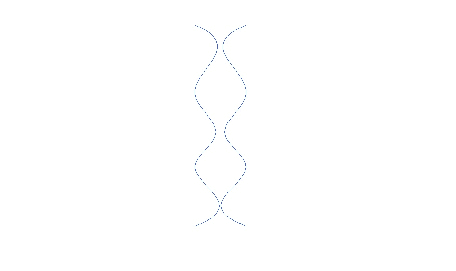
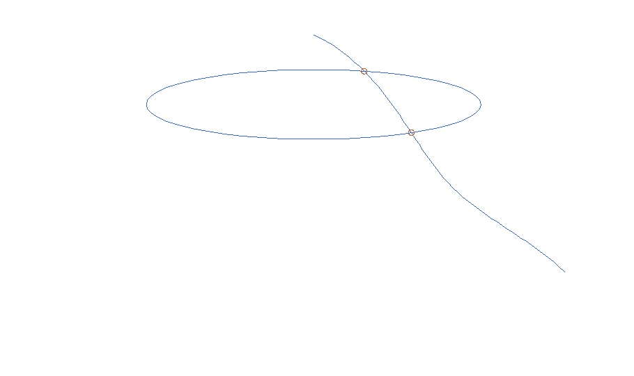
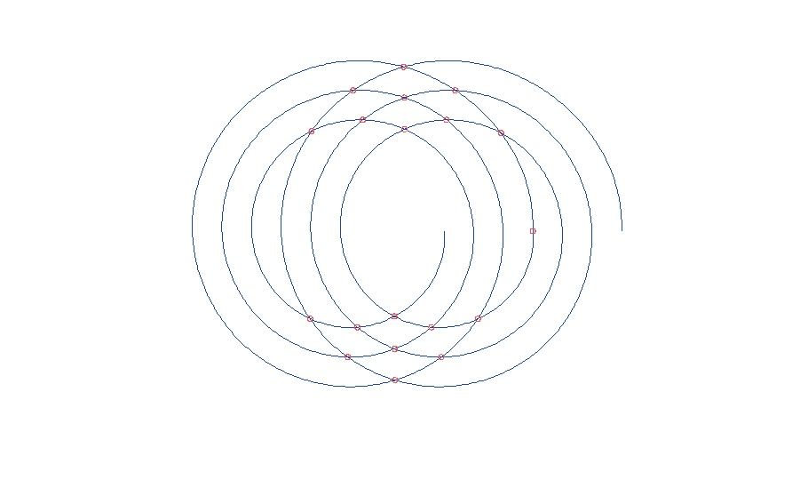
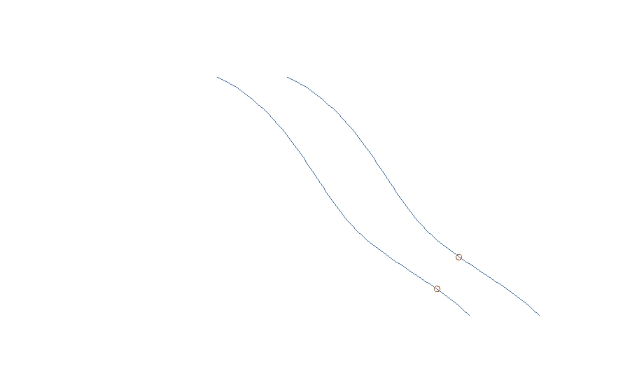
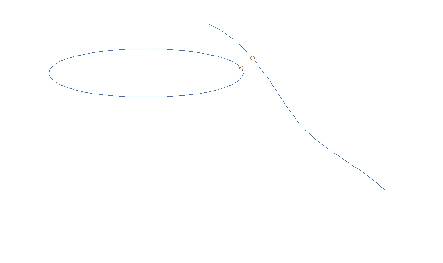

Spline
=========

C++/CUDA library for manipulating 2D parametric B-splines.

## Features

* Creation splines from a vector of points
* Creation of spiral-like splines
* Creation of ellipses
* Finding intersection points of two curves (splines or ellipses) with an accuracy of 1e-9 using Newton-Raphson optimization algorithm
* Finding the closest points of two curves (splines or ellipses) with an accuracy 1e-9 using RMSProp optimization or BruteForce search algorithms
* C++/CUDA and C++/OMP algorithms implementation

## Speed estimation

A high computation load example of a spline and an ellipse closest points finding:

	                  lib_v2       lib_v3
    RMSProp CPU	    ~ 3300 us **  ~ 2200 us **
    BruteForce CPU	~ 2600 us **  ~ 1100 us **
    BruteForce CUDA	~  790 us *** ~  460 us ***

** with Intel i5-13600KF
 
*** with NVIDIA GeForce RTX 3060 Ti

## Building

Linux:

    $ git clone https://github.com/Igkho/Spline.git
    $ cd Spline
    $ mkdir build
    $ cd build
    $ cmake ..
    $ make -j10

Windows:

* run CMake-gui;
* specify the source code and binary directories;
* press Configure button, set up the Generator settings (i.e. select the MSVC version);
* press Generate button;
* press Open project button to open solution in MSVC and build the solution;

Executables:

* Spline - the spline manipulation library
* SplineTests - unit tests of the library
* SplineExample - generates splines intersection and closest points finding examples

Documentation:

doxygen html documentation is generated in docs/html

Dependencies:
* the library depends on Eigen (fetched by Cmake), Nvidia CUDA, OpenMP (optional)
* tests depend on GoogleTest (fetched by Cmake)
* examples depend on OpenCV (to run the executable the OpenCV libraries should be on the search path)
* documentation building depends on Doxygen and GraphViz

Examples
--------

Intersecting two splines:

Intersecting a spline and an ellipse:

Intersecting spirals:

Closest points of two splines:

Closest points of a spline and an ellipse:

